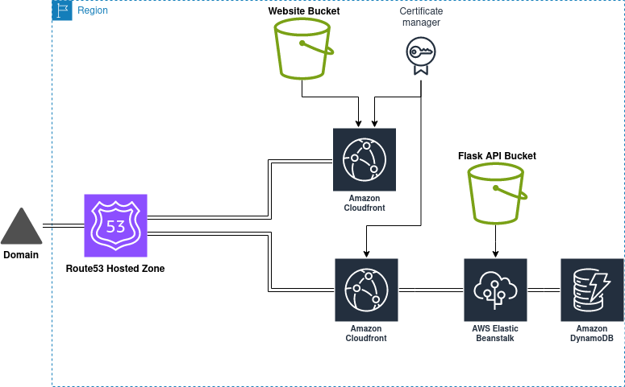
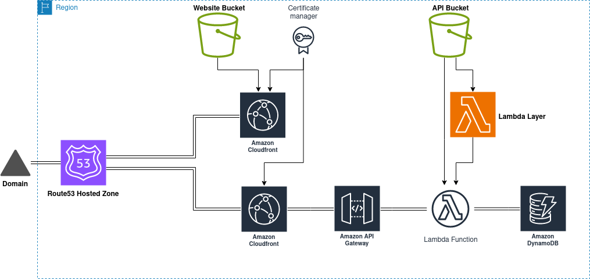

# terraform_aws
This repository contains folders each named after the application architecture that they use. Each application architecture contains a terraform main.tf file which provisions the whole architecture on aws by simply running<br/>
``` terraform init ``` and ``` terraform apply```
|Architecture|Services|
|------------|--------|
|Monolithic|EC2, ASG, ELB, S3, DynamoDB|
|Microservices|BS, S3, DynamoDB, Route53, Cloudfront|
|Serverless|S3, API Gateway, Lambda, DynamoDB, Route53, Cloudfront|
# Monolithic

<br/>
For the monolithic architecture the terraform configuration file automatically provisions the necessary EC2 instances. Instances utilize nginx and flask to provide both frontend and backend of the application. In this case the frontend is a simple static html website and the backend is a flask REST API which fetches data from a DynamoDB
database or puts the data in it depending on the request. After the instance configuration is created it is added to an Autoscaling Group which always keeps a set amount of instances running across multiple availability zones for that region. This keeps the application horizontally scalable which protects it in case of a server failure
in an availability zone(s). The application is also highly available since the autoscaling group is added to an elastic load balancer which equally distributes the traffic across multiple instances in different availability zones. Among other things the application also utilizes a permanent S3 storage bucket which contains the 
necessary configuration files for the EC2 instances.
# Microservices

<br/>
In the microservice application architecture the application is seperated into different components to achieve better reliability in case of failure. This terraform configuration utilizes elastic beanstalk for the backend of the application. The backend is represented by a flask API which retrieves or puts data into a DynamoDB database
depending on the request type. Elastic Beanstalk is also preconfigured with an autoscaling group which keeps the application highly scalable and an elastic load balancer which makes it highly available. The configuration also provisions 2 cloudfront distributions. First one is used for the frontend of our application which is a S3 bucket 
with a static website and the second one is used for the elastic beanstalk backend. This enables the application to use HTTPS by using a specific SSL certificate generated for the domain. Lastly a Route53 hosted zone for the domain we issued the certificate for is provisioned. Inside of the hosted zone 2 records are created. One record is a
redirect to the frontend cloudfront distribution and the other one is a redirct to the backend cloudfront distribution. By using this approach the static website gets redistributed to multiple locations because of the amazon's CDN(Cloudfront) but is accessible through one link because of a record in Route53. Same goes for the elastic
beanstalk backend.
# Serverless

<br/>
This architecture provides the most cost efficient approach by running the backend code only when it is needed instead of running it inside of an EC2 instance. Terrraform configuration for this architecture provisions a Lambda function which acts as the application backend which retrieves or puts the data inside of DynamoDB database. Since
the backend requires python dependencies a Lambda Layer is provisioned which contains all the necessary packages. The Lambda Function still needs a trigger to be activated so terraform provisions an API inside of API Gateway with all the necessary resources and methods which will trigger the Lambda Function. After the API is provisioned
2 Cloudfront distributions are created with SSL certificates for the domain. First one acts as a frontend by distributing the static website which is located inside of a S3 bucket and the other one is used for the API. Lastly a hosted zone is provisioned inside of Route53 with 2 records. One record is used for redirecting frontend traffic
to the frontend cloudfront distribution and the other one is used for redirecting API requests to the Cloudfront API distribution. This architecture is very similar to the microservices architecture but instead of constantly running EC2 instances in the backend it utilizes serverless aws services which are only running once they are called.
The drawback of this architecture is that the backend response time is slower compared to microservices and monolithic architectures.
